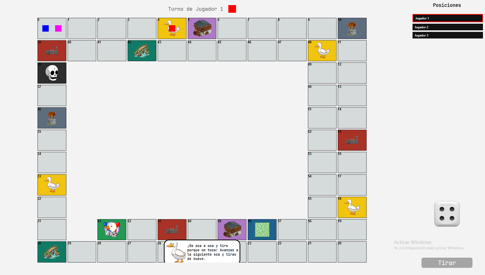

# Juego de la Oca - Proyecto POO

Este repositorio contiene la implementación de un juego de la Oca desarrollado como trabajo práctico para la materia Programación Orientada a Objetos (POO). El proyecto está escrito en **C++** utilizando el framework **Qt 6** y está organizado con **CMake**.

---

## 🧩 Descripción

El juego permite simular partidas de la clásica Oca, con:

- Tablero interactivo.
- Dados virtuales.
- Varios tipos de casillas (oca, cárcel, puente, pozo, etc.).
- Interfaz gráfica con ventanas para menú, partida, pausa, fin de juego, ajustes, etc.
- Guardado y carga de partidas.
- Sonidos y recursos multimedia.



El código está dividido en módulos:

- `logica/` &ndash; clases que representan casillas, jugador, tablero y la lógica del juego.
- `UI/` &ndash; formularios y controladores Qt (`.ui` y clases C++) para las distintas pantallas del juego.
- `ManejadorDeSonidos/` &ndash; reproducción de efectos de audio.
- `GestorDeGuardado/` &ndash; persistencia de partidas.
- Directorios específicos para cada componente (casillas, jugador, etc.).

---

## ⚙️ Requisitos

- **Qt 6** (ej. MinGW 64-bit, MSVC, etc.)
- **CMake** (versión 3.16 o superior recomendada)
- Compilador C++ (g++, clang, MSVC) compatible con C++17.

Asegúrate de tener instalado Qt y configurado en tu sistema para que CMake pueda encontrarlo.

---

## 🛠️ Construcción y ejecución

Consulta el PDF incluido en la raíz del repositorio para obtener instrucciones completas:

- **Instrucciones de compilación y ejecución del proyecto.pdf**

> El documento explica cómo preparar el entorno, configurar Qt/CMake, compilar y ejecutar la aplicación en distintos sistemas.

A modo de resumen rápido:

1. Clonar el repositorio:
   ```bash
   git clone <url-del-repo>
   cd POO-TP
   ```
2. Crear un directorio de compilación:
   ```bash
   mkdir build && cd build
   ```
3. Configurar con CMake:
   ```bash
   cmake ..
   ```
   Añade `-DCMAKE_PREFIX_PATH` si Qt no está en un path estándar.
4. Compilar:
   ```bash
   cmake --build .
   ```


---

## 📁 Estructura del repositorio

```text
CMakeLists.txt               # Archivo principal de CMake
main.cpp                     # Punto de entrada
logica/                      # Lógica de juego
...                          # Múltiples subdirectorios por componente
UI/                          # Ventanas e interfaces Qt
ManejadorDeSonidos/          # Control de audio
GestorDeGuardado/            # Guardado de partidas
...                          # Otros recursos: imágenes, sonidos, etc.
``` 

---

## 📝 Uso

- Ejecuta el programa y aparecerá el menú principal.
- Selecciona "Nueva partida" para comenzar a jugar.
- Puedes pausar, guardar, cargar o ajustar opciones desde el menú.
- Al finalizar la partida, se muestra una pantalla con el resultado.

---

## 🤝 Contribuciones

Este proyecto fue realizado como trabajo práctico, por lo que las contribuciones no están previstas. Aun así, sientete libre de explorar el código y proponer mejoras.

---

## 📄 Licencia

Libre para uso académico y personal. No dispone de licencia formal.

---

¡Disfruta el juego de la Oca! 🐌🎲
